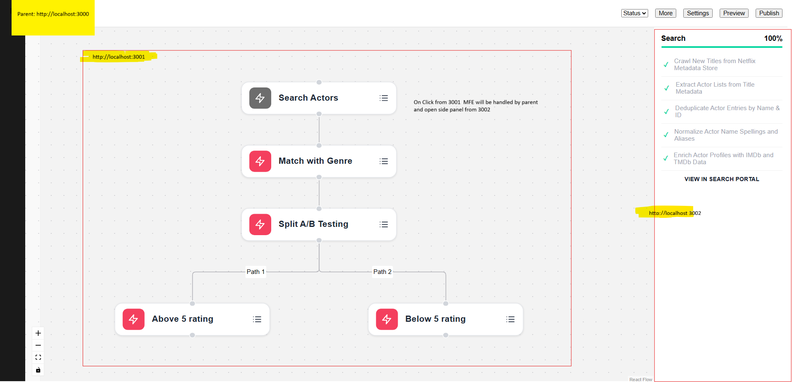

# Microfrontend Federation Playground

## Purpose

This project demonstrates a microfrontend architecture where independent services own and expose their own UI components, business logic, and deployment pipelines—while still participating in a unified user experience through a shared shell and design system.

## Example: Workflow View

In this example view, we highlight how three interdependent services collaborate through microfrontend federation:

1. **Consolidation Service**
   - Main consolidation platform located (`./ui/mf_consumer`)
   - Acts as the integration layer
   - Provides a unified shell and shared UI components  
   - Publishes a shared `npm` package (`./ui/shared-ui`) used by all other services

3. **Workflow Service**
   - Will live in another repo but in this repo for ease of example
   - Independently deployed and versioned example located at (`./ui/mf_workflow`)
   - Responsible for workflow execution and task state management  
   - Exposes a microfrontend that renders workflow-related UI

4. **Search Service**
   - Will live in another repo but in this repo for ease of example
   - Provides search insights, progress updates, or status tracking example located at (`./ui/mf_provider`)
   - Hooks into the workflow view to display search-related task data  
   - Owns its own backend and UI component, and integrates into the shared view

## Benefits of This Model

- **Autonomous Teams**: Each service owns its data, deployment, logic, and UI
- **Consistent UX**: Shared components (published via the consolidation service) ensure brand and interaction consistency
- **Composable UI**: The consumer shell dynamically loads service-owned microfrontends as needed
- **Scalable Architecture**: Services can evolve independently, enabling faster innovation and isolated deployments


## Example Screenshot



Tech Stack:

- **Rsbuild** for fast, configurable builds
- **Module Federation** for dynamic runtime composition
- **pnpm workspaces** for efficient dependency management
- **`mf_workflow`** and **`mf_provider`** remotes for isolated microfrontends
- **`@shared/ui`** component library for reusable, styled UI components
- **Turborepo** for task orchestration and build performance

---

## How to Run the Full System

```bash
pnpm install       # Install all dependencies from the root
pnpm build         # Build shared-ui and both remotes (provider and workflow)
pnpm dev           # Start dev servers in parallel
```
navigate to [http://localhost:3000/workflow](http://localhost:3000/workflow)
 - the workflow visualization is loading from localhost:3001
 - click on the search actors details icon and see that sidepanel loads from localhost:3002
### Local Dev Entry Points

- **mf_consumer** (host shell): [http://localhost:3000](http://localhost:3000)
  - Renders the `/workflow` route
  - Dynamically loads:
    - 🔹 `Workflow` component from **mf_workflow**
    - 🔹 `TaskList` component from **mf_provider**

- **mf_provider**: [http://localhost:3001/](http://localhost:3001/)
  - TaskList component

- **mf_workflow**: [http://localhost:3002/](http://localhost:3002/)
  - Workflow component


